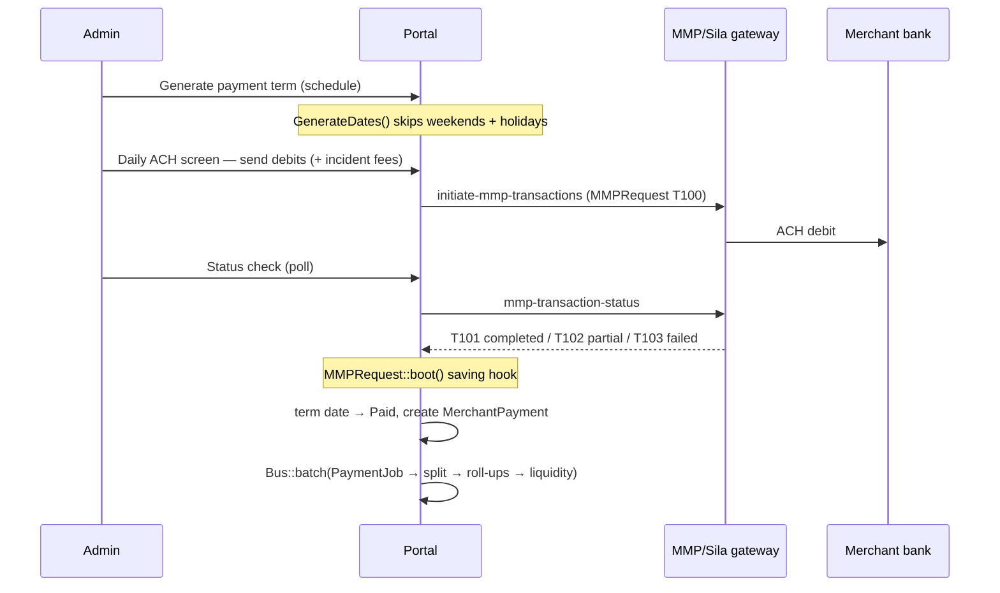

# Investor Portal v3 — Project Overview

> **Purpose of this document:** explain *what* this application does, *why* it exists, and how its four core flows work — merchant creation after funding, investment splitting, merchant-payment splitting, and ACH collection. It is written to be loaded by AI tooling (Claude Code, skills, prompts) as well as read by developers. Companion files: `CLAUDE.md` (session context), `docs/AI_CONTEXT_PROMPT.md` (copy-paste prompt), `REFACTOR_NOTES.md` (current code-quality audit).

---

## 1. What this application is, and why

Investor Portal v3 is the back office and investor front end for a **Merchant Cash Advance (MCA) syndication business**.

The business model: a funder advances cash to a small business (the **merchant**) in exchange for a fixed repayment amount (**RTR — right to receive** = `funded × factor_rate`). The funder does not carry the whole advance alone — multiple **investors** syndicate ("participate") in each deal, each taking a percentage share. The merchant repays in fixed installments (daily/weekly ACH debits or manual payments), and **every repayment must be split across the investors** according to their share, minus agent and management fees, tracked down to principal vs. profit.

The application exists to be the **single system of record** for that lifecycle:

- Record funded advances (merchants) and their economics (funded amount, factor rate, RTR, payment count).
- Record which investor funded what portion of which deal, and at what fee terms.
- Automatically split every incoming merchant payment across investors (fee cascade, overpayment handling, principal/profit attribution).
- Maintain each investor's cash position (**liquidity**) with a full audit trail.
- Schedule and collect merchant repayments via **ACH** through a third-party gateway (MMP/Sila), including return codes and ACH fee billing.
- Give investors a portal to browse the **marketplace** of open deals, self-invest, and see their portfolio/reports.

---

## 2. Actors and portals

| Actor | How stored | Portal |
|---|---|---|
| Admin / back office | `users` (`user_type_id = 1` + many staff sub-types) | `/Admin/...` — full management UI |
| Investor | `users` (`user_type_id = 2`) + `investors` profile row | `/Investor/...` — portfolio, marketplace, reports |
| Merchant | `users` (`user_type_id = 7`) + `merchants` advance row | *No portal* — merchants are records, not active users |
| Company | `users` (`user_type_id = 6`) — investor grouping | — (deals are allocated to companies, investors belong to a company) |
| Lender | `users` (`user_type_id = 4`) — deal source | — |
| Public visitor | — | `/fundings/...` — marketing site + public marketplace |

**The single most important schema fact:** `users.id` is the universal actor key. Almost every `merchant_id`, `investor_id`, and `company_id` column anywhere in the schema references `users.id`, **not** `merchants.id` / `investors.id`. E.g. `Merchant::Investors()` is `hasMany(MerchantInvestor::class, 'merchant_id', 'user_id')`.

Post-login routing (`LoginController::redirectTo()`): Admin → `/`, Investor → `/Investor/`, others → `/Admin/`. All route groups are gated only by `middleware('auth')` — there is currently **no per-role authorization layer** (documented P1 gap in `REFACTOR_NOTES.md`).

---

## 3. Domain model at a glance

```
users (universal actors, wallet: liquidity)
 ├── merchants                 1:1 by user_id — a FUNDED advance (economics + status + marketplace story)
 │    ├── merchant_companies       deal allocation across investor companies (% must sum to 100)
 │    ├── merchant_fees            fee templates on the deal (Commission, Syndication Fee, …)
 │    ├── merchant_banks           debit/credit bank accounts for ACH
 │    ├── merchant_payment_terms   ACH repayment schedule (daily/weekly/biweekly/monthly)
 │    │    └── merchant_payment_term_dates   each expected debit (status + ach_status)
 │    ├── merchant_ach_fees / _items          billed ACH incident fees (NSF, rejection, …)
 │    ├── merchant_faqs / merchant_securities / story columns   marketplace listing content
 │    └── merchant_status_logs     status audit trail
 ├── investors                 1:1 by user_id — investor profile (fee terms, payout frequency)
 ├── merchant_investors        THE PARTICIPATION: investor ↔ merchant, share %, funded, rtr, paid_* roll-ups
 ├── merchant_payments         one merchant repayment (or fee debit), with investors_* roll-ups
 │    └── merchant_payment_investors   per-investor slice: amount, agent_fee, management_fee, net, principal, profit
 ├── investor_transactions     investor wallet ledger (credits/debits, typed categories)
 ├── liquidity_logs            append-only audit of every users.liquidity change (batch_no groups a job run)
 └── m_m_p_requests            outbound ACH gateway requests + the callback that turns ACH into ledger rows

rcodes    NACHA ACH return codes (R01 Insufficient Funds, …)
holidays  dates skipped by payment scheduling
settings  key/value app config (minimum_investment_value, max_assign_percentage, …)
```

Most money columns are high-precision decimals (`16,8`; shares `16,12`). Merchants, participations, payments, transactions, and users are audited via `owen-it/laravel-auditing`.

---

## 4. Flow — a merchant is created *after* funding

There is **no lead/underwriting pipeline in this app**: a `Merchant` row is created only once a deal is already funded. `funded_date` and `funded` are required by `Merchant::rules()`, and `status_id` defaults to `1 = ActiveAdvance`.

Derived at save (`Merchant::boot()`, `app/Models/Merchant.php:115-131`):

```
rtr            = factor_rate × funded          # total the merchant owes
payment_amount = rtr / no_of_payment           # fixed installment size
```

Creation paths:

1. **Admin UI** — `app/Http/Livewire/Admin/Merchant/Create.php`: creates the merchant `users` row, then the `merchants` row, and validates that the `merchant_companies` allocation sums to 100% of the funded amount.
2. **External sync** — `php artisan sync:merchants` (`app/Console/Commands/SyncMerchant.php`): pulls funded deals from the external origination system (`IP_URL`), creating user + merchant (`marketplace = 'Yes'`) and seeding `merchant_fees` from the deal's commission fields.

Lifecycle after creation is the `status_id` enum: `ActiveAdvance(1)` → possibly `PaymentTemporarilySuspended(2)`, `Default(4)`, `Collections(5)`, `ReferredToLegal(10)`, … → terminal states `AdvanceCompleted(11)`, `Cancelled(17)`, `Settled(18)`. Every status change dispatches `StatusChangeJob` → `merchant_status_logs`.

Progress fields (`completed_percentage`, `balance`, `paid_count`, `syndicate_percent`, `last_payment_*`) are recomputed only by `app/Jobs/Merchant/MerchantUpdateJob.php` — never by hand.

---

## 5. Flow — investment (the *investment split*)

A participation is a `merchant_investors` row. The split key is **`share`** (percent, 12 decimal places):

```
share    = funded / merchant.funded × 100      # MerchantInvestor::boot(), app/Models/MerchantInvestor.php:60
rtr      = funded × merchant.factor_rate       # investor's slice of the repayment right
invested = funded + Σ investment fees          # InvestmentUpdateJob, app/Jobs/Merchant/InvestmentUpdateJob.php:44-45
```

Investment fees are copied from the deal's `merchant_fees` templates into `merchant_investor_fees` at assignment; each is `percentage × (funded | rtr)` depending on `based_on`.

Four ways a participation is created:

1. **Manual assign** (`Livewire/Admin/Merchant/AssignNewInvestor.php`) — admin picks investors from companies that hold an allocation; funded↔share stay in sync live; guards against exceeding the company's remaining balance.
2. **Auto-allocate by liquidity** (`Livewire/Admin/Merchant/InvestmentBasedOnLiquidity.php`) — pro-rates the company's remaining balance across investors by available liquidity (`user.liquidity / max_assign_percentage` setting), dropping investors below `minimum_investment_value`.
3. **Auto-allocate by payment** (`Livewire/Admin/Merchant/InvestmentBasedOnPayment.php`).
4. **Investor self-service** via the marketplace (`Livewire/Investor/Marketplace.php`, `Livewire/Funding/Agreement.php`) — creates the row with `active_status = 'Pending'`; admins approve on the *Pending Investment* screen.

On create/delete, `InvestmentUpdateJob` finalizes `invested`, refreshes `users.liquidity`, and appends a `liquidity_logs` row (`amount = −invested`, description `Investment`).

---

## 6. Flow — merchant payment (the *payment split*)

Every repayment becomes one `merchant_payments` row plus one `merchant_payment_investors` row per participating investor. Entry points (all dispatch the same batch):

- Admin **Add Payment** modal (`Livewire/Admin/Merchant/AddPayment.php`) — manual / ACH / credit-card / fees
- **Lender bulk payment** (`Livewire/Admin/Merchant/LenderPayment.php`) — all of a lender's merchants across dates
- **Excel upload** (`Livewire/Admin/Upload/Payment.php`) — resolves merchants by legacy id, R-codes by code
- **Automatic on confirmed ACH** (`MMPRequest::boot()` — see §7)

```
Bus::batch([ PaymentJob,            # split the payment across investors
             MerchantUpdateJob,     # recompute merchant roll-ups
             InvestorUpdateJob ])   # recompute investor roll-ups + liquidity
```

**The split algorithm** (`app/Jobs/Merchant/PaymentJob.php`):

1. For each active participation: `amount = payment × share / 100` (line 82).
2. Cap at the investor's remaining `balance (= rtr − paid_amount)`; excess accumulates as *overpayment* and is redistributed to investors that still have balance; any leftover goes to a special `UserType::OverPayment` pseudo-investor. Negative payments (reversals/returns) unwind in reverse and cannot exceed what was paid.
3. Fee cascade (lines 103‑108):

   ```
   agent_fee      = amount × payment.agent_fee_percentage / 100        # merchant-level %
   management_fee = amount × investor.management_fee_percentage / 100
   net_amount     = amount − agent_fee − management_fee
   ```

4. Principal/profit attribution: `net_amount` repays the investor's `invested` first (**principal**); everything beyond is **profit** (lines 156‑203).
5. `MerchantPaymentUpdateJob` rolls the slices up into `merchant_payments.investors_*`.

`payment_mode_id = 4 (Fees)` is special: `MerchantFeeJob` assigns the entire amount to a `UserType::MerchantFees` pseudo-investor with zero fees.

`InvestorUpdateJob` then recomputes each participation's `paid_amount`, `paid_management_fee`, `paid_agent_fee`, `paid_net_amount`, `paid_principal`, `paid_profit`, `completed_percentage`, refreshes `users.liquidity`, and appends `liquidity_logs` rows (one `batch_no` per run).

---

## 7. Flow — ACH collection



Key pieces:

- **`merchants.ach_flag`** (`2 = ACHActive`) marks a deal as ACH-collected; the merchant view then requires at least one payment term.
- **`merchant_payment_terms`** — the schedule (advance type `daily/weekly/biweekly/monthly_ach`, amount, count, Active/Paused). **`merchant_payment_term_dates`** — each expected debit, statuses `NotPaid, InProgress, Paid, PartiallyPaid, Paused, Cancelled, Failed`; `ach_status` stores the gateway's status text. Date generation (`Livewire/Admin/Merchant/Terms.php::GenerateDates()`) skips Saturdays, Sundays, and every `holidays.date`.
- **`merchant_banks`** — debit/credit accounts (routing/account numbers, default flags).
- **Daily operation** — `/Admin/Account/Merchant/Payment/ACH/Generate` lists due term dates, lets the operator attach incident fees from the global catalogue (`ach_rejection $35, nsf $35, bank_change $35, blocked_account $100, ach_fee $35, default_fee $5000, others $1` — `app/Helpers/helpers.php:164-191`) as `merchant_ach_fees`, then sends debits. `php artisan payment:ach` can send all due debits (manual; not in the scheduler).
- **Gateway** — `app/Helpers/MMPHelper.php` posts to `{MMP_URL}` with `Access-Token`/`Api-Key`. Every request/response is stored in `m_m_p_requests` (gateway codes `T100 in process, T101 completed, T102 partial, T103 failed`).
- **Reconciliation** — `MMPRequest::boot()::saving` is the ACH→ledger bridge: a completed merchant debit marks the term date `Paid/PartiallyPaid` and creates the real `MerchantPayment` with `payment_mode_id = ACH`, triggering the full split pipeline; a completed investor transfer creates an `investor_transactions` credit/debit instead.
- **`rcodes`** — seeded NACHA return codes (R01 Insufficient Funds, R02 Account Closed, …) attachable to payments (returns).
- Investors are KYC-registered with Sila at signup (`register-individual-external`; `users.user_handle` + address/SSN/DOB fields).
- **No NACHA file generation** — all ACH goes through the MMP HTTP API. `app/Exports/` only holds Excel report exports.

---

## 8. Money ledgers

- **`users.liquidity`** — the investor's wallet balance: `Σ investor_transactions.amount + Σ(merchant_investors.paid_net_amount − invested)`. Recomputed only by `LiquidityUpdateJob`.
- **`investor_transactions`** — external cash movements (Transfer To Marketplace, Transfer To Bank, distributions, fees, …); debits stored negative.
- **`liquidity_logs`** — append-only trail of every liquidity change: delta, resulting balance, `batch_no` grouping one job run. Written by `InvestmentUpdateJob`, `InvestorUpdateJob`, and `InvestorLiquidityLogJob`.

---

## 9. Marketplace (investor-facing)

Deals with `marketplace = 'Yes'` and `status_id = ActiveAdvance` are listed (single query source: `app/Helpers/FundingHelper.php`) on the public site (`/fundings/marketplace`, details, FAQ/security accordions, story caption/text/image) and the logged-in investor marketplace (`/Investor/Marketplace`, which hides already-funded deals and converts gross ↔ net ↔ percentage using the deal's total fee percentage). Self-investments require min $100, block re-investing, and enter as `Pending` for admin approval. Investors also get a portfolio (`/Investor/Merchant`) and Payment / Investment / Transaction reports.

---

## 10. Background jobs (the write path)

All financial roll-ups are **job-owned**. UI/imports only create the primitive rows and dispatch:

| Job | Owns |
|---|---|
| `PaymentJob` | splitting a payment into `merchant_payment_investors` (share %, caps, fee cascade, principal/profit, overpayment) |
| `MerchantUpdateJob` | `merchants.completed_percentage, balance, paid_count, syndicate_percent, last_payment_*` |
| `InvestorUpdateJob` | `merchant_investors.paid_*`, `completed_percentage`, liquidity + logs |
| `InvestmentUpdateJob` | `merchant_investors.invested`, `investment_fee_amount`, liquidity + logs |
| `MerchantPaymentUpdateJob` | `merchant_payments.investors_*` roll-ups |
| `LiquidityUpdateJob` | `users.liquidity` |
| `MerchantFeeJob` | fee-mode payments to the MerchantFees pseudo-investor |
| `StatusChangeJob` | `merchant_status_logs` |
| `MerchantAchFeeUpdateJob` | syncing ACH fees onto term dates |

**Rule: never write these columns directly — dispatch the job.** Job completion is broadcast to the UI via Pusher (`MerchantJobResult`).

---

## 11. Key files

| Concern | File |
|---|---|
| Payment split math | `app/Jobs/Merchant/PaymentJob.php` (share line 82, fees 103‑108, principal/profit 156‑203) |
| Investor roll-ups | `app/Jobs/Merchant/InvestorUpdateJob.php:49-88` |
| Merchant roll-ups | `app/Jobs/Merchant/MerchantUpdateJob.php:25-49` |
| Investment finalize | `app/Jobs/Merchant/InvestmentUpdateJob.php:44-45` |
| Share derivation | `app/Models/MerchantInvestor.php:52-78` |
| RTR / installment derivation | `app/Models/Merchant.php:115-131` |
| ACH → ledger bridge | `app/Models/MMPRequest.php:59-142` |
| ACH schedule generation | `app/Http/Livewire/Admin/Merchant/Terms.php:128-197` |
| ACH gateway client | `app/Helpers/MMPHelper.php` |
| Marketplace deal query | `app/Helpers/FundingHelper.php` |
| Fee catalogues | `app/Helpers/helpers.php:152-191` |
| External deal sync | `app/Console/Commands/SyncMerchant.php` |

---

## 12. Known gaps & current work

The codebase predates modern Laravel conventions and is being refactored module-by-module on branch `refactor/best-practices` (see `REFACTOR_NOTES.md` for the authoritative audit). Highlights:

- **P1:** almost no validation layer; no authorization layer (any authenticated user can hit `/Admin/*`); string-interpolated raw SQL in report code; exceptions swallowed or leaked to users.
- **Architecture:** fat controllers/Livewire components; an 821-line `MerchantHelper` building SQL by concatenation; stored-procedure calls inside model accessors.
- **Convention going forward:** business logic in `app/Actions/<Module>/<Name>Action.php` returning `ActionResult`; legacy model `selfCreate()/selfUpdate()/selfDelete()` methods are deprecated shims.
- **Tests:** effectively none; refactors are verified by module smoke-testing.
- Module 1 (Admin/Account) is done, including a Livewire rebuild of the Account list without Yajra.
